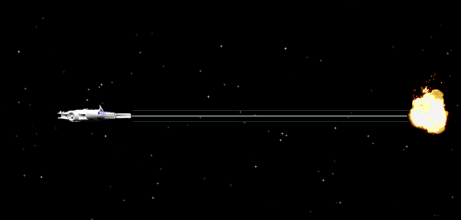



## Defender Remake \- Work In Progress

### Description

This is my current lunchtime project - a remake of the classic defender. This is the first stage and there's a lot more to go. So why put the code up already? Well this is an open source code site and the very simple way I've coded this makes it a very useful starting point for vb and graphics (use of APIs for drawing lines, pixels, sprite animation against a ticker whilst creating a whole image for frame buffering to screen). At this stage there is enough in here to teach you how to create your own scrolling shooter without having to start from scratch. Votes are obviously appreciated, but I just love sharing code. enjoy and I hope if you use this project as a seed, post it on PSC. Cheers, Fosters.
 
### More Info
 

             |
---                |---
**Submitted On**   |2003-09-29 08:23:14
**By**             |[Fosters](https://github.com/Planet-Source-Code/PSCIndex/blob/master/ByAuthor/fosters.md)
**Level**          |Intermediate
**User Rating**    |5.0 (10 globes from 2 users)
**Compatibility**  |VB 5\.0, VB 6\.0
**Category**       |[Games](https://github.com/Planet-Source-Code/PSCIndex/blob/master/ByCategory/games__1-38.md)
**World**          |[Visual Basic](https://github.com/Planet-Source-Code/PSCIndex/blob/master/ByWorld/visual-basic.md)
**Archive File**   |[Defender\_R1651549292003\.zip](https://github.com/Planet-Source-Code/fosters-defender-remake-work-in-progress__1-48868/archive/master.zip)

